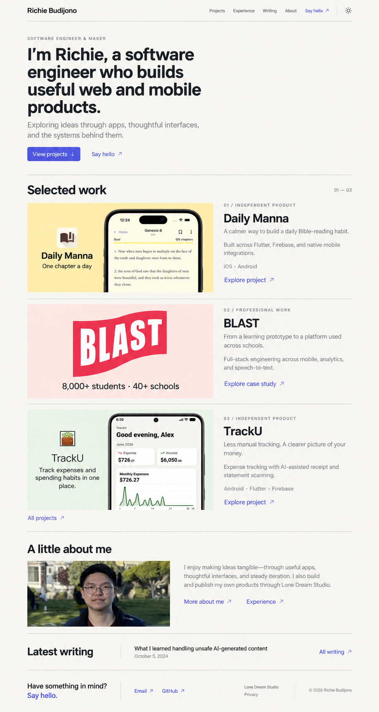

# Richie Budijono — Personal Portfolio Redesign

## Visual reference and review

This image is a design concept generated with the built-in imagegen tool, using the existing Daily Manna and TrackU artwork, BLAST logo, and Richie portrait as references. It demonstrates layout, visual hierarchy, palette, and content placement; it is not an implemented page. Implementation must use the original assets and real text rather than the generated image as the website. Small text and image details in the mockup are illustrative.

Review this concept with Richie and incorporate requested visual revisions before implementing website changes. The approved written requirements below remain authoritative where the mockup differs. No production deployment is included.

## Summary

Reposition the site around Richie the engineer and maker: what he builds, how he thinks, and the experience behind his work. Serve peers, collaborators, and potential employers without a consulting sales pitch.

Chosen introduction: “I’m Richie, a software engineer who builds useful web and mobile products.”

Success means visitors can quickly understand who Richie is, explore his contributions, and contact him.

## Design and homepage

- Warm off-white backgrounds, charcoal text, restrained indigo links, generous spacing, thin dividers, and minimal shadows. Remove the background grid, floating shapes, gradients, and sales banners from portfolio pages.
- Retain Space Grotesk and Source Sans typography. Aim for a content width around 1,120px and article columns around 720px; stack layouts on mobile.
- Default new visitors to light mode, retain the theme toggle, and remember their selection.
- Keep motion to subtle hover/focus transitions and respect reduced-motion preferences.
- Homepage order: compact left-aligned introduction; selected work; About preview; latest writing; contact/footer. Selected work should begin within the initial desktop viewport.
- Hero actions: “View projects” and “Say hello.”
- Selected work order: Daily Manna, BLAST, TrackU. Use generous image-and-text rows showing the project, contribution, and one supported outcome or capability.
- Use original app screenshots for Daily Manna and TrackU. Use the BLAST logo with supported outcome typography until suitable product imagery exists; do not invent a dashboard.
- About preview uses the existing portrait and links to About and Experience. Writing shows the existing article without placeholder cards. Footer includes email, GitHub, and secondary Studio links.

## Navigation and content

| Destination | Behavior |
| --- | --- |
| Projects — `/projects` | Dedicated mixed portfolio collection, replacing the redirect to Insights. |
| Experience — `/work` | Preserve career history; simplify the timeline into readable roles, dates, and achievements. |
| Writing — `/insights` | Keep article URLs, change the visible label, remove the full project collection. |
| About — `/about` | Present background, interests supported by existing work, and approach to engineering. |
| Say hello | Open the existing email address; no contact form. |
| Studio — `/studio` | Secondary page linked from About and footer; remove its consulting call to action. |

- Projects order: Daily Manna, BLAST, TrackU, Y Lift, remaining active products, then a separate experiments/archive section. No filters for the current collection.
- Preserve `/projects/[slug]`. Add `/work/[slug]` pages for the existing BLAST and Y Lift case studies.
- Put project title, summary, and role before large imagery. Organize narratives around context, contribution, implementation decisions, and supported outcomes. Include lessons only where sources support them.
- Keep product websites, app-store downloads, and source links as secondary actions.
- Remove services, sales FAQs, engagement-process sections, budget questions, and consultant language throughout the site.
- Preserve Studio product visibility settings and its privacy-policy URL.

## Implementation and compatibility

- Reuse Next.js, Tailwind, and MDX; read the installed Next.js guides before implementation.
- Keep product and professional case-study collections separate. Add a shared portfolio display model for selected work and Projects without duplicating content.
- Add optional product contribution text supported by existing content. Store homepage ordering explicitly, independently of Studio placement.
- Redirect `/services` to `/projects` and `/start-a-project` to `/about#contact`. Remove the inquiry form and unused submission functionality.
- Preserve existing legacy redirects. Retain an anchor at `/insights#projects` with a clear link to the new Projects collection for old bookmarks.
- Update titles, descriptions, social previews, sitemap, and structured data. Replace consultant positioning with software-engineer positioning and remove the consulting Service entry.
- Reconcile Y Lift’s case-study end date with the existing experience record: January 2026.

## Verification and defaults

- Run existing tests, lint, and a production build. Add focused checks for mixed portfolio selection, case-study lookup, and missing slugs.
- Check mobile/desktop layouts, keyboard navigation, contrast, both themes, reduced motion, and readable screenshot sizing.
- Verify project links, redirects, email links, article URLs, metadata, and the Studio privacy page.
- Confirm each featured project explains Richie's contribution and no consulting sales flow remains.
- Use existing claims, images, and public links. Do not invent metrics, personal details, testimonials, or project decisions.
- Keep AI video work in Experience until a supported case study is available. Do not add a résumé download, CMS, analytics service, or animation dependency.
- End implementation with a reviewable local preview; production deployment is separate.

## Image-generation brief

Built-in imagegen; UI mockup composed from existing project artwork and portrait. Prompt direction: create a flat, full-page desktop editorial portfolio on warm off-white with charcoal type and restrained indigo accents. Use a slim Projects/Experience/Writing/About navigation, compact engineer-and-maker introduction, three horizontal selected-work rows in Daily Manna/BLAST/TrackU order, a personal About preview, latest writing, and minimal email/GitHub footer. Preserve supplied product identities and portrait. Avoid consulting language, sales banners, invented dashboards, testimonials, or extra metrics. This is a visual review concept before implementation.
